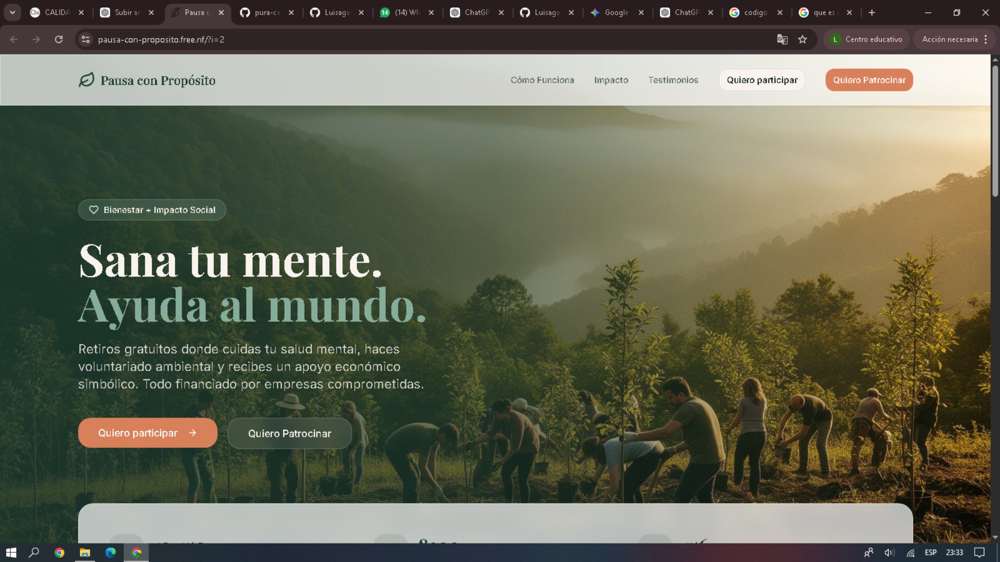
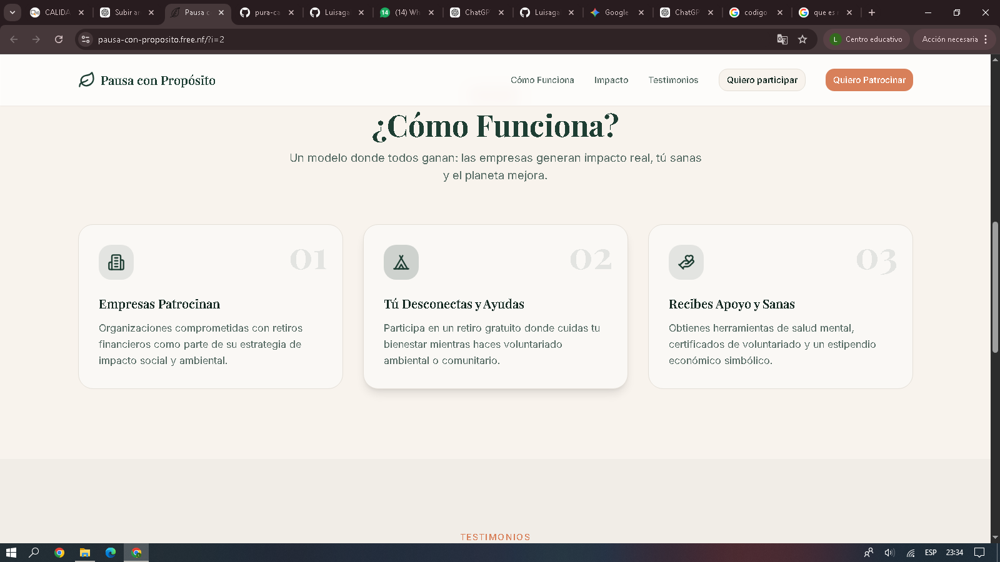
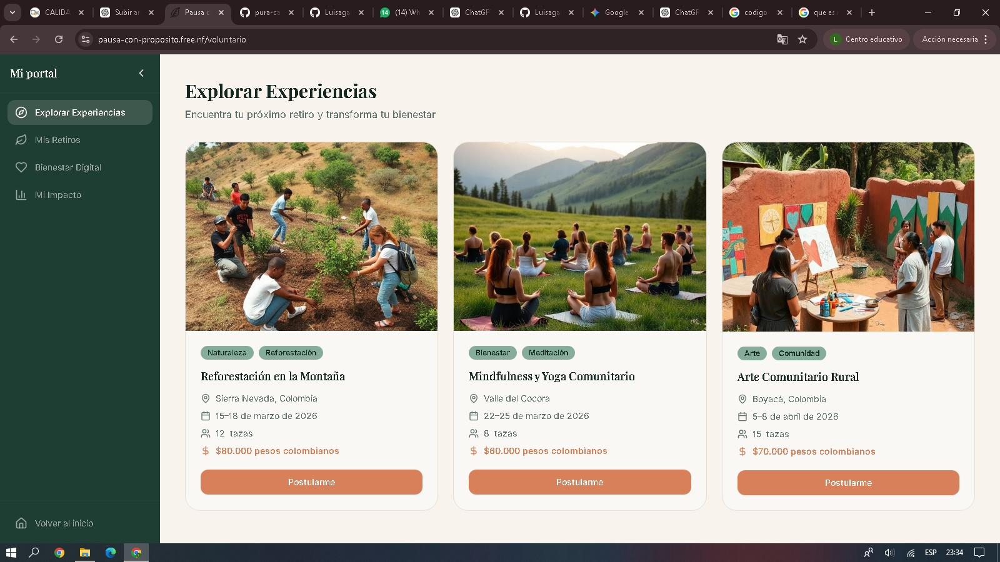

# Pausa con Próposito

## Información General

Nombre del proyecto: Pausa con Próposito
Nombre del estudiante: Luisa Carranza  
Fecha: 28 de Febrero de 2026  
Curso: Técnico en Programación y Plataformas Digitales  

---

## Descripción del Proyecto

“Pausa con propósito” es un proyecto enfocado en promover momentos de pausa consciente dentro de la rutina diaria, no solo como un descanso físico sino como un espacio intencional para reflexionar, reconectar con uno mismo y dar sentido a lo que se hace.

La idea central es invitar a las personas a detenerse en medio del ritmo acelerado de la vida, reducir el estrés y recuperar claridad mental y emocional. Este tipo de iniciativa busca fomentar el bienestar integral, ayudando a las personas a analizar sus metas, fortalecer su enfoque, renovar su energía y tomar decisiones con mayor conciencia.

Generalmente incluye mensajes de reflexión, contenido motivacional o espiritual, y propuestas prácticas como ejercicios de respiración, momentos de introspección o dinámicas de mindfulness que permiten reconectar con los valores personales y el propósito de vida.

En esencia, el proyecto trata de enseñar que hacer una pausa intencional no es perder tiempo, sino invertirlo en crecimiento personal, equilibrio emocional y dirección consciente.

---
 ¿Qué hace el proyecto?

El proyecto “Pausa con propósito” es una página web interactiva que ofrece contenido reflexivo, motivacional y práctico para fomentar momentos de pausa consciente en la rutina diaria. Presenta textos, ejercicios e ideas que ayudan a las personas a detenerse, respirar, reflexionar y reconectar con sus valores personales y su propósito de vida.

 ¿Qué problema soluciona?

Este proyecto soluciona el problema de la sobrecarga mental y emocional que muchas personas experimentan por el ritmo acelerado de la vida moderna. Ayuda a reducir el estrés, recuperar claridad mental, mejorar el enfoque y promover el bienestar integral al ofrecer herramientas simples para hacer pausas intencionales y significativas durante el día.

 ¿Para quién está pensado?

El proyecto está pensado para:

✔ Personas que viven con estrés o ansiedad por la rutina
✔ Estudiantes y trabajadores con jornadas intensas
✔ Quienes buscan mejorar su bienestar emocional
✔ Cualquier persona interesada en la reflexividad, mindfulness o crecimiento personal

En resumen, está dirigido al público en general que desea inclusión de momentos de calma y reflexión en su vida diaria.
## Tecnologías Utilizadas

- HTML
- CSS
- JavaScript
- React
- Vite
- Tailwind CSS
- Git y GitHub

---

## Estructura del Proyecto

El proyecto contiene las siguientes carpetas principales:

- src (componentes y lógica principal)
- public (archivos públicos)
- package.json (dependencias del proyecto)

---

## Funcionalidades

- Página principal interactiva
- Navegación entre secciones
- Diseño responsivo adaptable a diferentes dispositivos
- Organización estructurada del código
- Interfaz moderna y dinámica

---

## Cómo Ejecutar el Proyecto

1. Clonar el repositorio:
   git clone https://github.com/Luisagall/pura-causa-2026

2. Instalar dependencias:
   npm install

3. Ejecutar el proyecto:
   npm run dev

---

## Mejoras Futuras

- Implementar modo oscuro
- Integrar base de datos
- Crear panel de administración

---
---

## Capturas del Proyecto

### Página de Inicio

### Cómo Funciona

### Portal de Experiencias

Este proyecto fue desarrollado como parte del curso Técnico en Programación y Plataformas Digitales.
